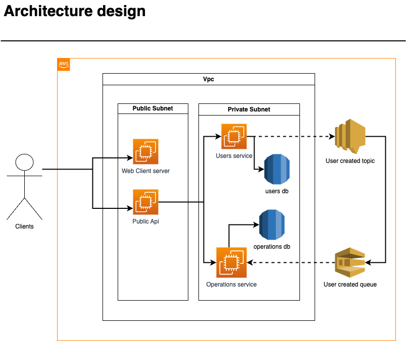

# Project Challenge

This project is part of a trueNorth technical challenge. The automatic local set up instructions are available only for macOS distributions.

## Table of Contents
- [About](#about)
  - [Api design](#api-design)
- [Prerequisites](#prerequisites)
- [Init Setup](#init-setup)
- [Run App](#run-app)
- [Kill App](#kill-app)
- [Manual set up](#manual-set-up)
  - [Mockery installation](#mockery-installation)
  - [SNS-SQS Config](#sns-sqs-config)
- [Troubleshooting](#troubleshooting)

## About
This project has been implemented using Aws services. You're going to find the live version at **https://personal.oswaldrijo.site/**.

The credentials to get access are Username: **username** and Password **pass1**, nevertheless if you decide to create your own
user, the app is prepared for creating users.

### Api design
The technologies involve are:
- Aws Services:
  - Ecs
  - Rds
  - Secret Manager
  - Sns/Sqs
- Languages:
  - Golang
  - Javascript (using typescript), for Front End. For the Backend Javascript for servers (node) with typescript and NestJs
- Api Rest
- Http2 (grpc)

The architecture was designed thinking on microservices, using Event Driven pattern with Http2 for internal communications and using a Public Api
for handling authentication and enabling Rest endpoint to allow Front End to communicate with backend services with the main goal of adding an extra security layer.

Following there is a diagram to give you a brief look of the app architecture.


## Prerequisites

Before setting up the environment, the automated script only works **For MacOS users**, but first you need certain dependencies to be installed before:

- Ensure **Go** and **Node** are both installed   
- Ensure **PSQL cli** is installed.   
- Ensure that you have **Homebrew** and **AWS CLI** installed.
- Ensure **make** command is available
- Ensure **docker-compose** command is available

**Note:**
- The installation script may require root permissions.
- You must be logged into AWS in the terminal where you will run the setup, as the installation script creates resources in AWS.
- The grpc stubbies are contained in each Language under dir name **pb**. That folder does not contains tests since it is autogenerated code, which for simplicity matters i decided to add rather than generate them to save time on set up.

## Init Setup

To install the required dependencies, run the following command:

```bash
./scripts/setup-local-env.sh
```

After the script has successfully run, ensure that the QUEUE is able to consume messages from the SNS topic.
To do so:
1. Go to AWS Console.
2. Select us-region-2, 
3. Go to [Simple Notification Service](https://us-east-2.console.aws.amazon.com/sns/v3/home?region=us-east-2#/topics)
4. Select tn_user_created_topic
5. Click on `Publish Messaje` button
6. Type message of your preference, click on `Publish Message`.

After that go to [Simple Queue Service](https://us-east-2.console.aws.amazon.com/sqs/v3/home?region=us-east-2#/queues) and check if the message was received by the queue.
To do so:

1. Click on `tn_user_created_queue`
2. Click on `Send and receive messages`
3. Click on `Poll for messages`
4. Et voila. You should be able to see the message you just sent. 

Make sure you remove the message to prevent a failure within the app.
If you're not seeing the message please go to [Troubleshooting section](#troubleshooting)

## Run App

To start the application, execute the following command:
```bash
./scripts/run-app.sh
```

## Kill App

To stop the application, run the following command:
```bash
./scripts/kill-app.sh
```
The command will remove all docker images previously created but the database image, reason why i encourage you to check it and remove it by yourself

## Manual set up
  If for some reason the automatic set up has failed or the distribution you're using is not macOS, here you'll find what you need for setting up the env.
### Mockery installation

At the src/go dir run:
```bash
go install github.com/vektra/mockery/v2@v2.44.2
```

### Sns Sqs config

First create sns topic with name **tn_user_created_topic** and queue with name ***tn_user_created_queue*, then follow these instructions to complete the configuration https://docs.aws.amazon.com/AWSSimpleQueueService/latest/SQSDeveloperGuide/sqs-configure-subscribe-queue-sns-topic.html
After the creation and association are done, save the queue name and topic arn at **.properties** file at root as follows.
```txt
USER_CREATED_QUEUE=tn_user_created_queue
USER_CREATED_TOPIC_ARN=arn:aws:sns:us-east-2:<ACCOUNT_ID>:tn_user_created_topic
AWS_REGION=us-east-2
```

Finally we're ready to follow [Run App](#run-app) indications for running app

## Troubleshooting
### AWS CLI: "Unable to locate credentials"

This error is related to AWS authentication. To resolve this issue:

1. Refresh your AWS credentials.
2. Re-run the script that failed.

### SNS/SQS: Issues with message consumption in AWS region `us-east-2`
If the **QUEUE** is not consuming messages from the **SNS** topic, follow these steps:

1. Open the **AWS SNS Console** and locate the topic named `tn_user_created_topic`.
2. Delete the existing subscription to the queue `tn_user_created_queue`.
3. Recreate the subscription via the **AWS UI**.
4. Once the subscription is re-established, publish a test message from the **AWS SNS UI** to verify that the queue is correctly consuming messages.

If the **QUEUE** is still not consuming messages from the **SNS** topic, follow these steps:

1. Open the **AWS SQS Console** and locate the queue `tn_user_created_queue`
2. Delete the existing subscription topic named `tn_user_created_topic`.
3. Recreate the subscription via the **AWS UI** this time from SQS service.
4. Once the subscription is re-established, publish a test message from the **AWS SNS UI** to verify that the queue is correctly consuming messages.